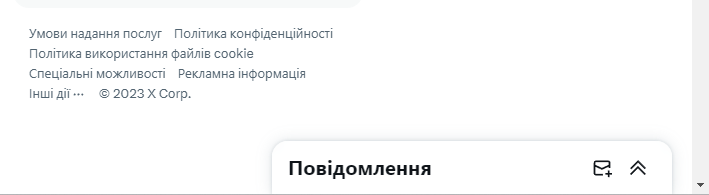
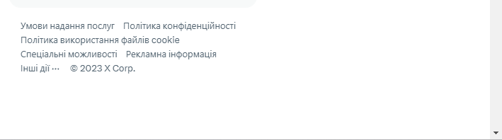
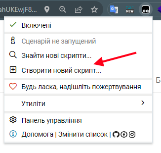
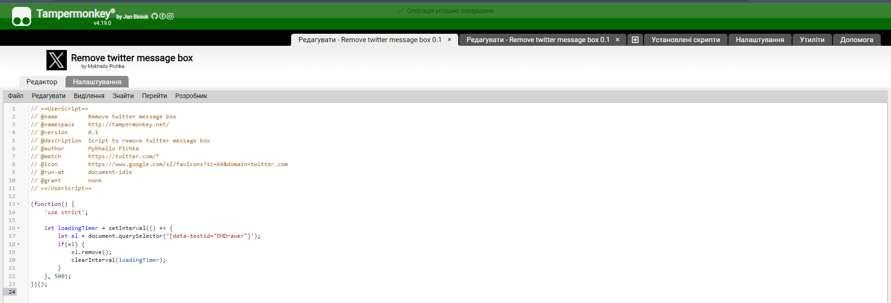
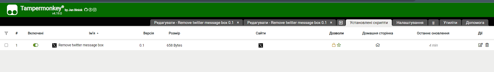

# Twitter-ex-message-box

Це простий скрипт який видаляє меседж бокс з сторінки твітеру.

Користуйтеся безкоштовно :)

Free to use!

## Приклад
### Як виглядає твітер до скрипта:

### Як виглядає твітер після:

## Встановлення
### Крок 1
Встановіть розширення для браузера **Tampermonkey**. Це розширення дозволяє запускати на сторінці користувацькі скрипти.

Лінки для завантаження:
- [Google Chrome](https://chromewebstore.google.com/detail/tampermonkey/dhdgffkkebhmkfjojejmpbldmpobfkfo?hl=uk&pli=1)
- [Mozilla Firefox](https://addons.mozilla.org/uk/firefox/addon/tampermonkey/)
- [Safari](https://apps.apple.com/us/app/tampermonkey/id1482490089)
- [Opera](https://addons.opera.com/en/extensions/details/tampermonkey-beta/)

### Крок 2
Запустіть **Tampermonkey** на сторінці та створіть новий скрипт

### Крок 3
Видаліть весь код з редактора та замініть його кодом з файлу `index.js`. Натисніть комбінацію `Ctrl+S` щоб зберегти зміни.

### Крок 4
Перевірте наявність скрипта та його активність

### Крок 5
Ви чудові!

## Підтримка
Якщо у вас виникнуть проблеми зі скриптом - створіть баг тікет та опишіть вашу проблему: [https://github.com/mpichka/twitter-ex-message-box/issues](https://github.com/mpichka/twitter-ex-message-box/issues)
